# Qwen Code Dashboard

## Details

This dashboard offers a clear view into Qwen Code CLI usage and performance. It highlights token spend and prompt cache efficiency, turn and session volume, model latency and time to first chunk, tool activity and failures, and the split between user-driven and background subagent work.

To start sending Qwen Code telemetry to SigNoz, follow the [Qwen Code observability guide](https://signoz.io/docs/qwen-code-observability/).

## Dashboard panels

### Sections

### Sessions

Distinct CLI sessions, counted on `session.id`. Read this next to Agent Turns to tell a lot of short one-shot invocations apart from a few long working sessions.

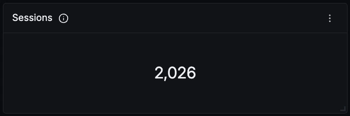

### Agent Turns

Every prompt-and-response cycle the agent completed, one `qwen-code.interaction` span each. Background subagent work is deliberately excluded here, since the user never asked for it.

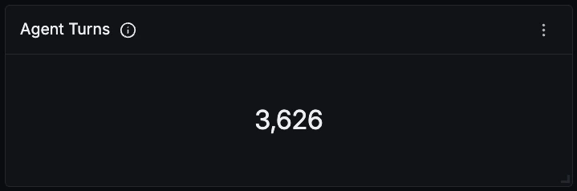

### Model Calls

One count per request to the model, background subagent calls included. Divided by Agent Turns this gives round trips per turn, which is the honest measure of how much reasoning a task actually costs.

### Tool Calls

Every tool the agent executed. Counted on `qwen-code.tool` only, because `qwen-code.tool.execution` is its child and an unscoped count doubles the total.

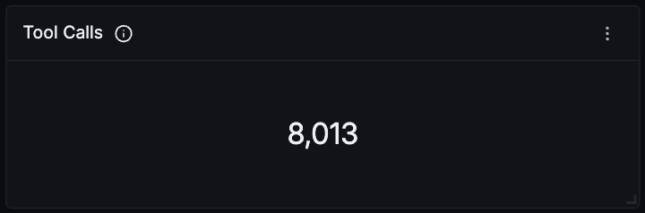

### Total Tokens

Input plus output tokens across every model call. Qwen Code emits no `total_tokens` attribute, so this sums the two components rather than reading a single field.

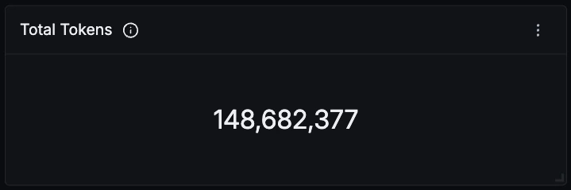

### Prompt Cache Hit Rate

Share of input tokens served from the prompt cache. Cached input bills at a discount, so on a token-heavy agent workload this is the single biggest lever on cost.

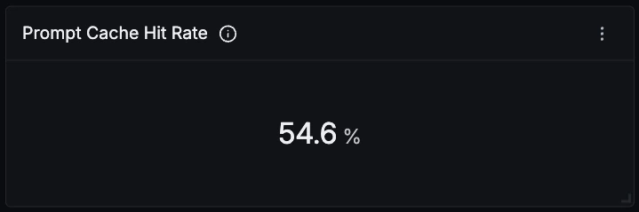

### Cached Input Tokens

Input tokens read from the cache instead of being reprocessed. This climbs through a long session, because every turn replays the conversation so far.

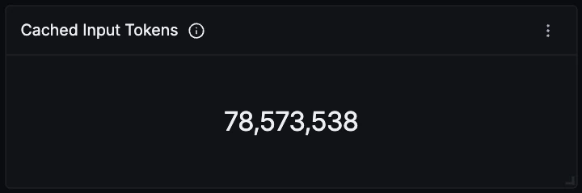

### Failed Tool Calls

Tool calls where `success` is false. Note that Qwen emits `success` as a boolean rather than a string, so it filters correctly but will not group reliably; the panels here work around that.

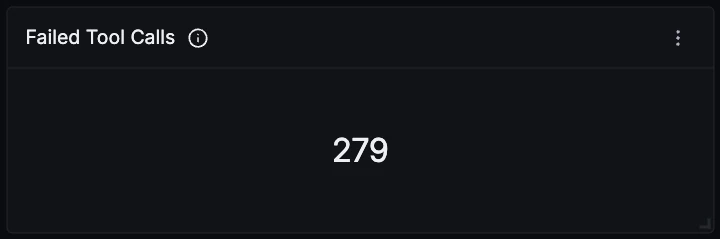

### Token Usage Over Time

Input, cached input and output tokens over time. Cached input is a subset of input rather than an additional charge, so the two lines track each other. Output stays low and flat on almost any agent workload, since most model calls are short decisions about which tool to run next.

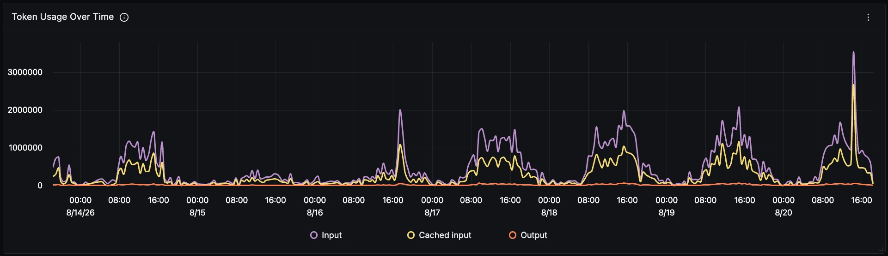

### Tokens by Model

Token spend per model. Useful for tracking migration between model versions and for spotting which model is actually carrying the workload, which is rarely the one you assume.

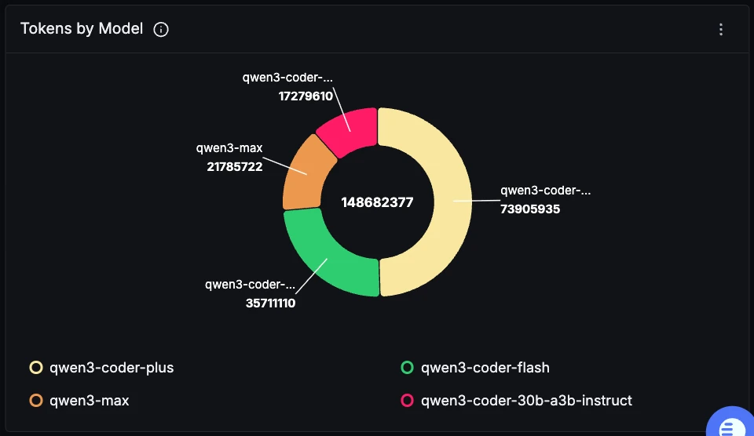

### User-Driven vs Background Tokens

`llm_request.context` splits calls made for a user turn (`interaction`) from background work the user never requested (`standalone`). Background spend never appears in the TUI, so this is usually the first place a surprise on the bill shows up.

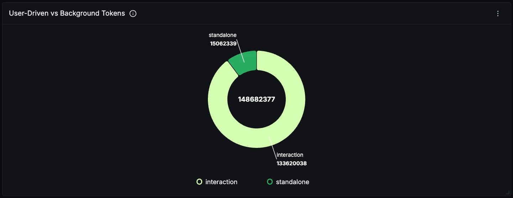

### Tokens by Background Subagent

Which background subagent is spending the tokens, such as the auto-memory extractor and the dreamer. Read it with the panel above: if the standalone slice grows, this says which subagent grew it.

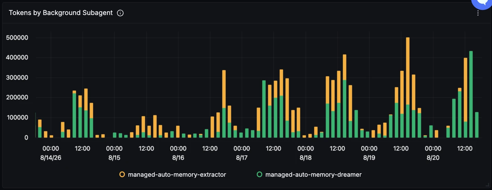

### Token Usage by Type (metric)

The same spend read from the `qwen-code.token.usage` counter instead of from spans, split into input, cache, output and thought. The thought line sits flat at zero on current builds, which is a Qwen Code reporting gap rather than an absence of reasoning.

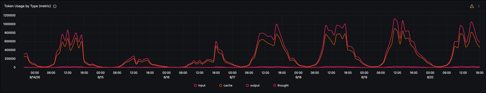

### Model Call Latency

p50, p95 and p99 duration of `qwen-code.llm_request` spans. This tracks answer length more than provider health, so a rising p99 usually means longer responses. Check it against Time to First Chunk to tell the two apart.

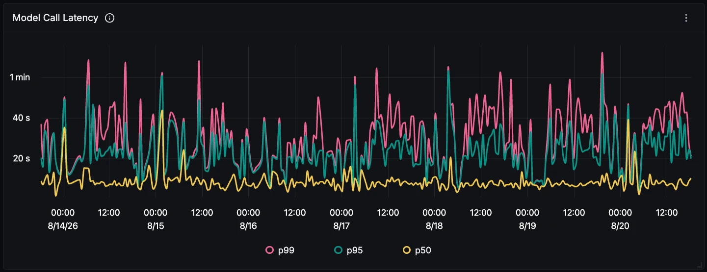

### Time to First Chunk

How long the model takes to start streaming. Unlike total latency this is independent of answer length, so it is the honest measure of provider responsiveness and the one developers actually feel.

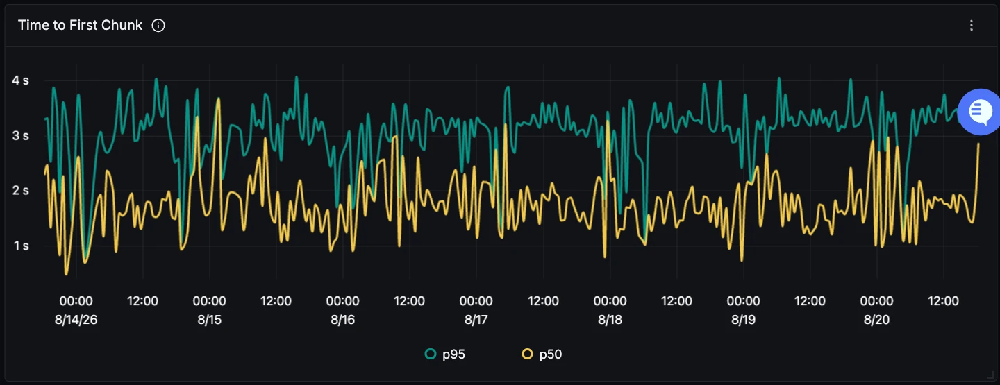

### Model Calls Over Time

Requests per model over time. Worth watching for the moment the agent falls back to a different model than the one you configured, which shows up here before it shows up anywhere else.

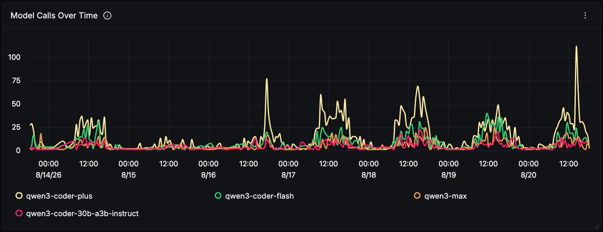

### Finish Reasons

Why each model call stopped. `tool_calls` running level with or above `stop` is the normal shape for an agent: most calls end by reaching for a tool, and only the last call of a turn ends with a finished answer. Values render inside brackets because `gen_ai.response.finish_reasons` is a real array, not a string.

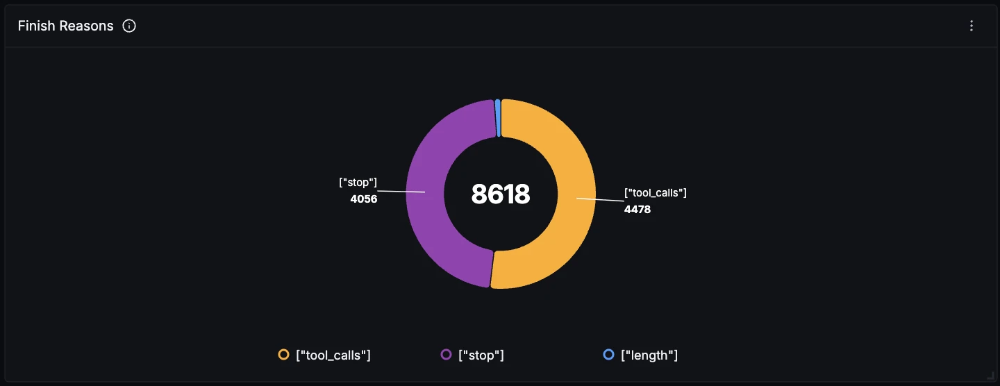

### Tool Calls by Name

Which tools the agent reaches for, over time. This is a good read on what kind of work the agent is trusted with: heavy `run_shell_command` and `edit` means it is changing things, heavy `read_file` and `grep_search` means it is still exploring.

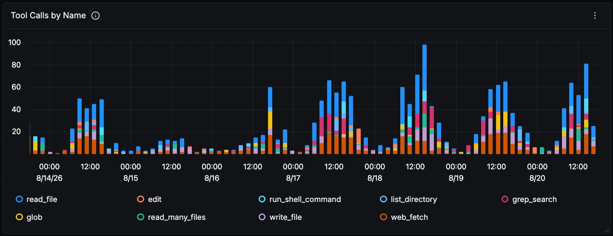

### Tool Success vs Failure

Split of tool calls by outcome. Built from two filtered queries rather than a groupBy, because `success` is emitted as a boolean and does not group. Failures here are usually environmental, a missing file or a command that exits non-zero, rather than model problems.

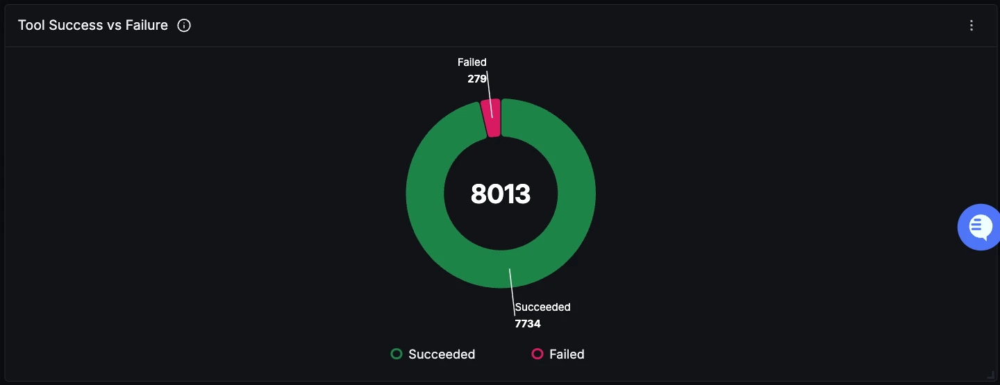

### Tool Latency (p95)

Slowest tools by p95 execution time. Shell commands dominate and are worth attention even when they never fail, since every second here is a second the model sits idle mid-turn and the developer sits watching.

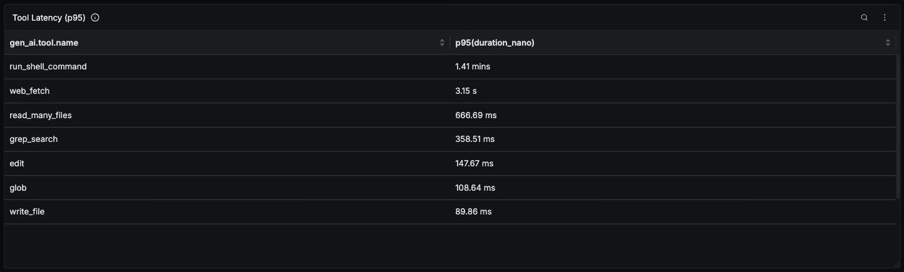

### Real Errors Over Time

Errored spans with `qwen-code.hook` excluded. That exclusion is load-bearing: hook spans error by design and would otherwise bury every genuine failure under them.

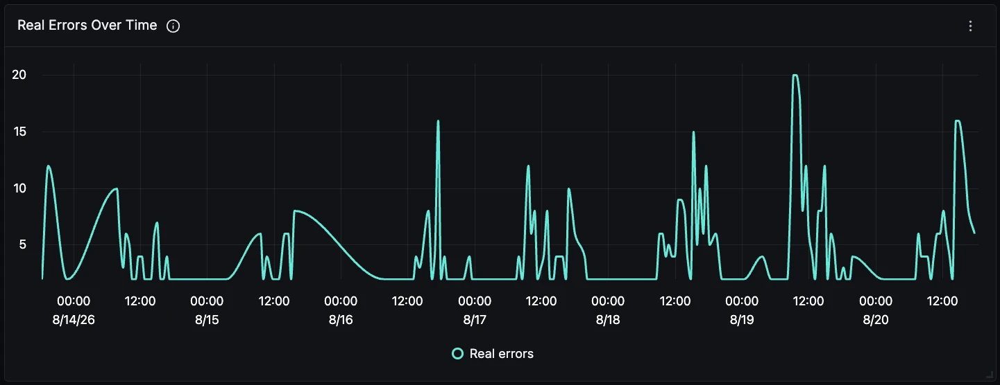

### Hook Runner Health

`qwen-code.hook` spans on their own. With no hooks configured every one of these reports `hook runner returned no output without error detail`, and it is harmless. Watch this panel for a change in shape rather than for any non-zero value.

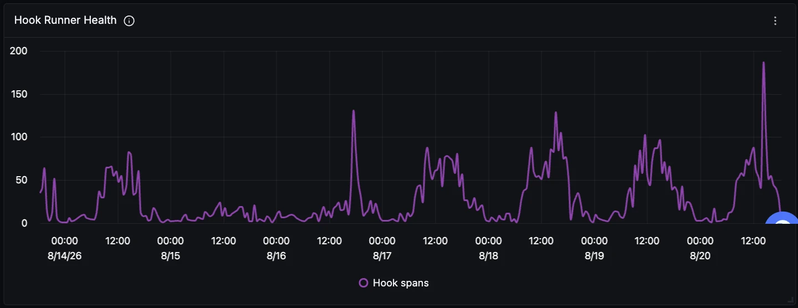

### CLI CPU Usage

Peak CPU percentage reported by the agent process, from the `qwen-code.cpu.usage` gauge. Useful for catching a runaway tool or a file watcher that never settles.

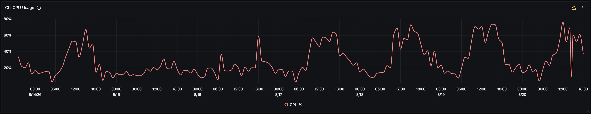

### Recent Real Errors

Individual failing spans with their status message, hooks excluded again. A tool failure shows up twice, once on `qwen-code.tool` and once on its `qwen-code.tool.execution` child; click any row through to the full trace to see the turn that produced it.

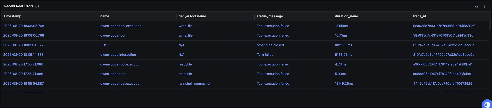
