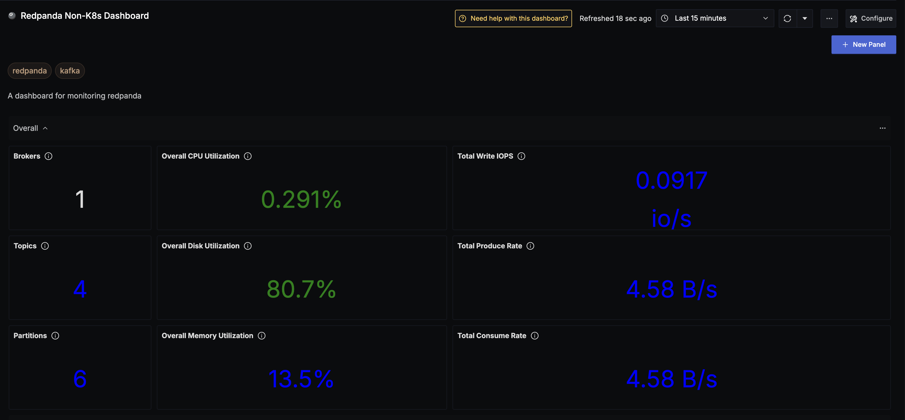
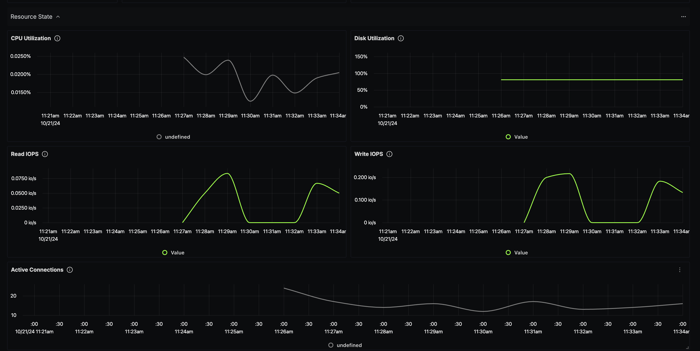
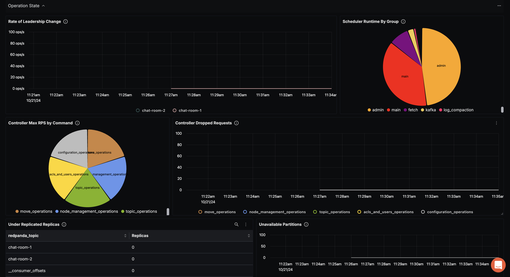
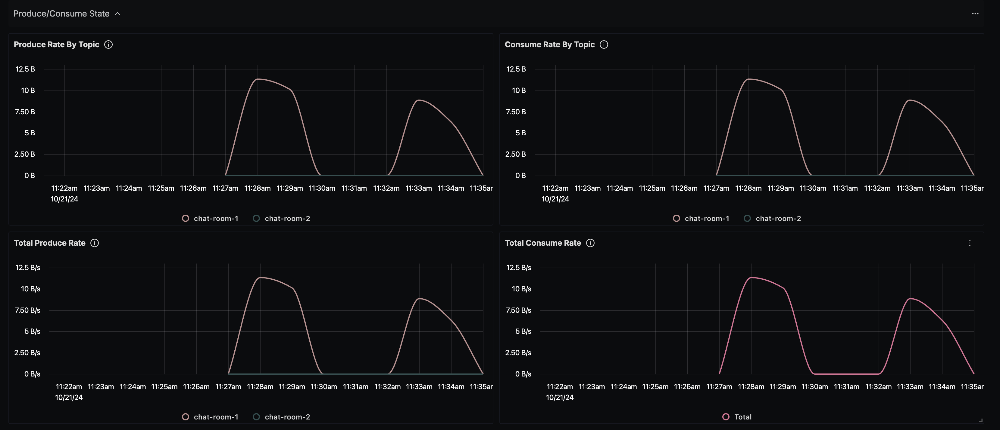
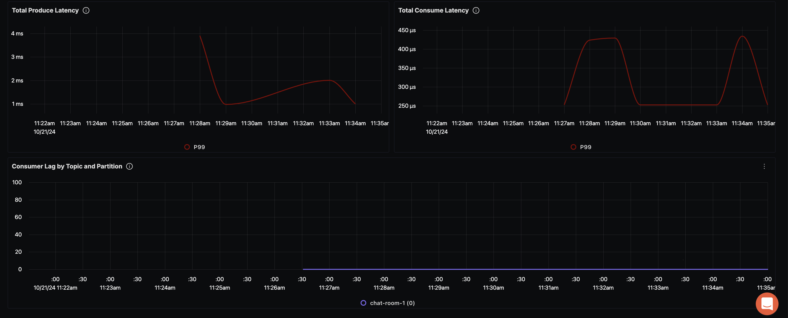

# Redpanda Non-K8s Dashboard - OTLP

## Data Ingestion - Redpanda (Non-k8s: Docker, Cloud, etc.)

### Integrate Redpanda with OpenTelemetry Collector

Follow the instructions on the official Redpanda website's [page](https://docs.redpanda.com/current/manage/monitoring/) about integrating OpenTelemetry with Redpanda, and the different metrics that are exposed by Redpanda.

## Variables

- `{{deployment_environment}}`: Deployment environment

## Dashboard panels

### Sections

- Overall
  - Brokers - `redpanda_cluster_brokers`
  - Topics - `redpanda_cluster_topics`
  - Partitions - `redpanda_cluster_partitions`
  - Overall CPU Utilization - `redpanda_cpu_busy_seconds_total`
  - Overall Disk Utilization - `redpanda_storage_disk_free_bytes`
  - Overall Memory Utilization - `redpanda_memory_allocated_memory`
  - Total Write IOPS - `redpanda_io_queue_total_write_ops`
  - Total Produce Rate - `redpanda_kafka_request_bytes_total`
  - Total Consume Rate - `redpanda_kafka_request_bytes_total`
  - Screenshot of Overall Section - 
- Resource State
  - CPU Utilization - `redpanda_cpu_busy_seconds_total`
  - Disk Utilization - `redpanda_storage_disk_free_bytes`
  - Read IOPS - `redpanda_io_queue_total_read_ops`
  - Write IOPS - `redpanda_io_queue_total_write_ops`
  - Active Connection - `redpanda_rpc_active_connections`
  - Screenshot of Resource State Section - 
- Operation State
  - Rate of Leadership Change - `redpanda_raft_leadership_changes`
  - Scheduler Runtime by Group - `redpanda_scheduler_runtime_seconds_total`
  - Controller Max RPS by Command - `redpanda_cluster_controller_log_limit_requests_available_rps`
  - Controller Dropped Requests - `redpanda_cluster_controller_log_limit_requests_dropped`
  - Under Replicated Replicas - `redpanda_kafka_under_replicated_replicas`
  - Unavailable Partitions - `redpanda_cluster_unavailable_partitions`
  - Screenshot of Operation State Section - 
- Produce/Consume State
  - Produce Rate by Topic - `redpanda_kafka_request_bytes_total`
  - Consume Rate by Topic - `redpanda_kafka_request_bytes_total`
  - Total Produce Rate - `redpanda_kafka_request_bytes_total`
  - Total Consume Rate - `redpanda_kafka_request_bytes_total`
  - Total Produce Latency - `redpanda_kafka_request_latency_seconds_bucket`
  - Total Consume Latency - `redpanda_kafka_request_latency_seconds_bucket`
  - Consumer Lag by Topic and Partition - `redpanda_kafka_max_offset`
  - Screenshot of Produce / Consume State Section - 
  
