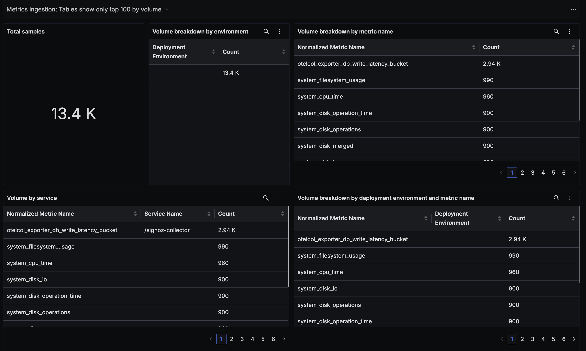
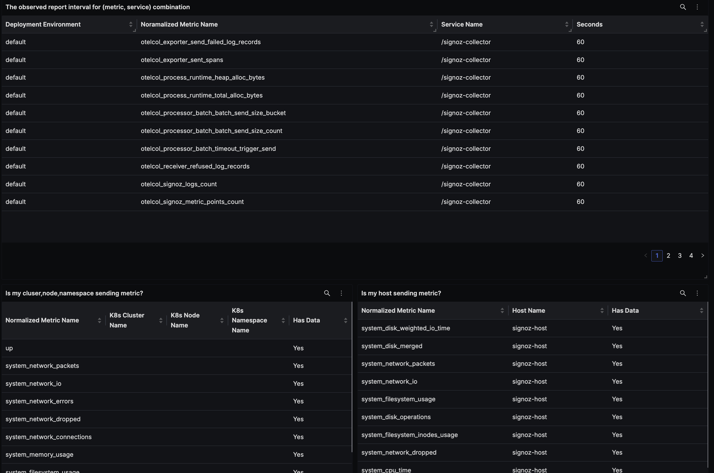
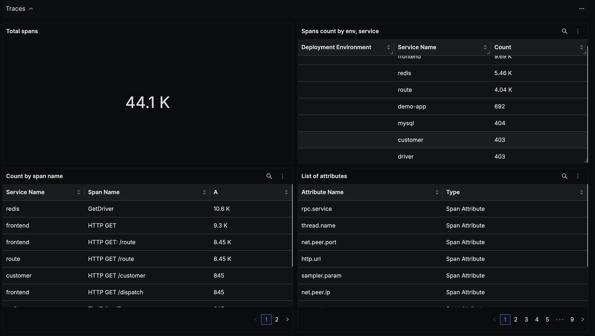
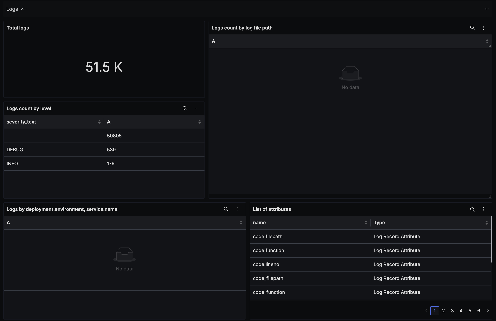

# SigNoz Ingestion Analysis Dashboard

## Details

This dashboard shows the metrics, traces and logs ingested. Only last 15 minutes of data is shown as this is mainly intended to help you understand the recent volume.

Please follow the following guides to control your data sent to SigNoz.
- Metrics: https://signoz.io/docs/userguide/drop-metrics/ 

- Logs: https://signoz.io/docs/logs-management/guides/drop-logs/ 

- Traces: https://signoz.io/docs/traces-management/guides/drop-spans/

## Dashboard panels

### Sections

- Metrics
  - Screenshots of Metrics Section -  
- Traces
  - Screenshot of Traces Section - 
- Logs
  - Screenshot of Logs Section - 
