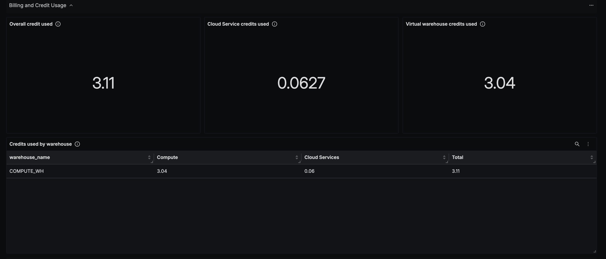
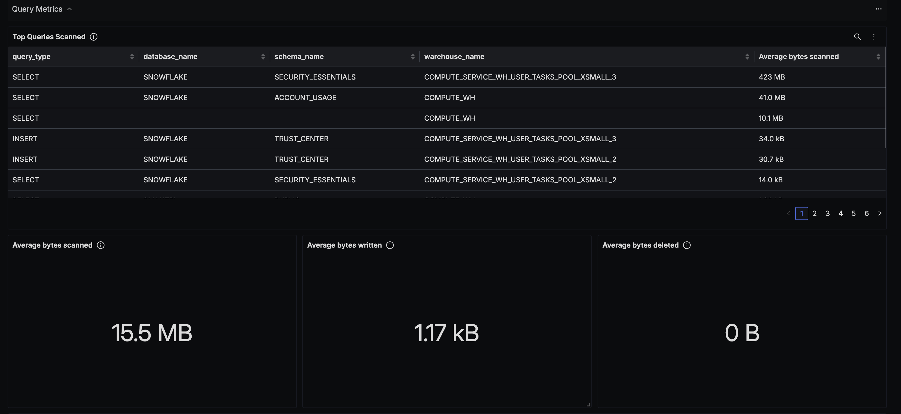

# Snowflake Dashboard - OTLP

## Data Ingestion

### Integrate Snowflake with OpenTelemetry Collector

You can collect the metrics from Snowflake using the Snowflake receiver in OpenTelemetry as shown [here](https://github.com/open-telemetry/opentelemetry-collector-contrib/tree/main/receiver/snowflakereceiver).

## Dashboard panels

## Variables

- `{{deployment_environment}}`: The deployment environment for the service.
- `{{snowflake_account_name}}`: Snowflake account name.

### Sections

- Billing and Credit Usage
  - Overall credits used - `snowflake_billing_total_credit_total`
  - Cloud Service credits used - `snowflake_billing_cloud_service_total`
  - Virtual warehouse credits used - `snowflake_billing_virtual_warehouse_total`
  - Credits used by warehouse - `snowflake_billing_warehouse_virtual_warehouse_total`, `snowflake_billing_warehouse_cloud_service_total` and `snowflake_billing_warehouse_total_credit_total`
  - Screenshot of Billing and Credit Usage Section - 
- Query Metrics
  - Top queries scanned - `snowflake_database_bytes_scanned_avg`
  - Average bytes scanned - `snowflake_database_bytes_scanned_avg`
  - Average bytes written - `snowflake_query_bytes_written_avg`
  - Average bytes deleted - `snowflake_database_bytes_deleted_avg`
  - Query Execution vs Query Compilation time - `snowflake_query_execution_time_avg` and `snowflake_query_compilation_time_avg`
  - Average rows inserted - `snowflake_rows_inserted_avg`
  - Average rows updated - `snowflake_rows_updated_avg`
  - Average rows deleted - `snowflake_rows_deleted_avg`
  - Average rows produced - `snowflake_rows_produced_avg`
  - Screenshot of Query Metrics Section -  
- Storage Metrics
  - Total storage byets - `snowflake_storage_storage_bytes_total`
  - Total staged byets - `snowflake_storage_staged_bytes_total`
  - Total failsafe byets - `snowflake_storage_failsafe_bytes_total`
  - Average bytes spilled to remote storage - `snowflake_query_bytes_spilled_remote_avg`
  - Average bytes spilled to local storage - `snowflake_query_bytes_spilled_local_avg`
  - Screeenshot of Storage Metrics Section - 
- Other Metrics
  - Total logins - `snowflake_logins_total`
  - Average Session IDs per user - `snowflake_session_id_count`
  - Screenshot of Other Metrics Section - 
