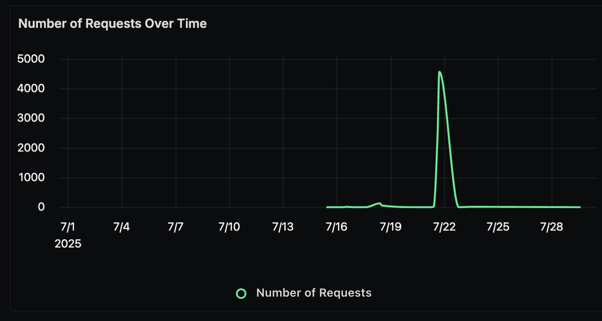
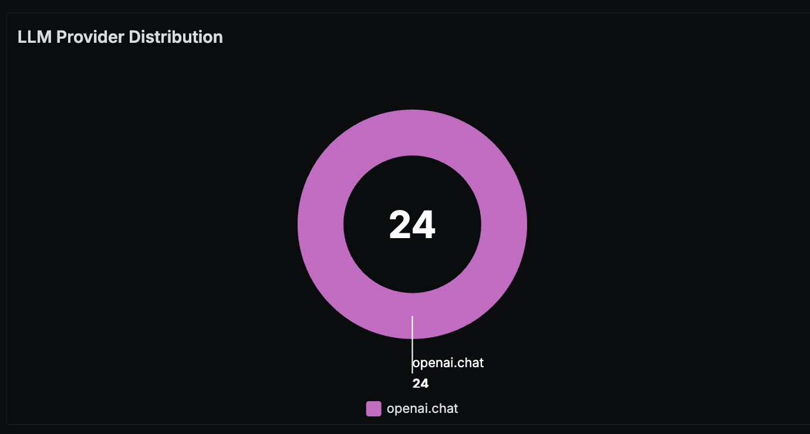
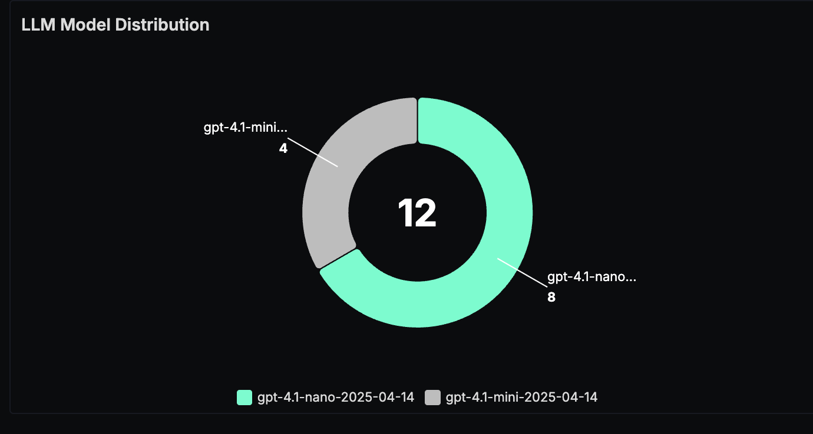
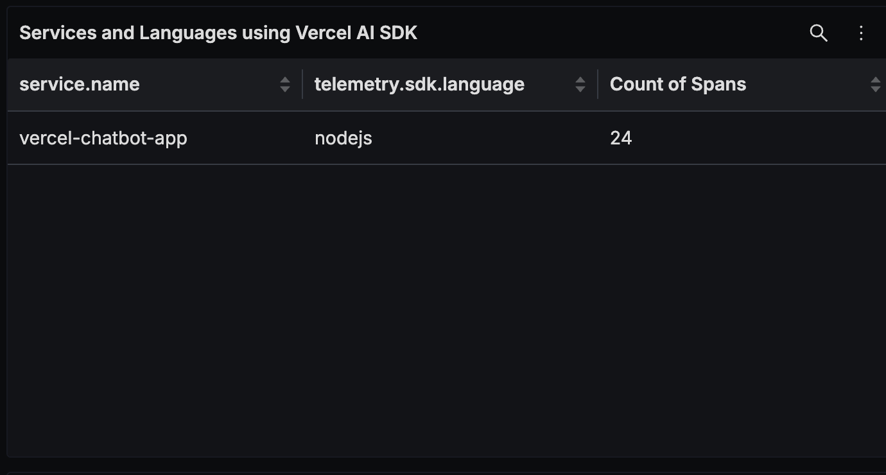

# Vercel AI SDK Dashboard

## Details

This dashboard shows the latency, token usage, token output rate, and filtered reqeusts by latency of your Vercel AI SDK application.

Please follow the following guides to control your data sent to SigNoz.
- Metrics: https://signoz.io/docs/userguide/drop-metrics/ 

- Logs: https://signoz.io/docs/logs-management/guides/drop-logs/ 

- Traces: https://signoz.io/docs/traces-management/guides/drop-spans/

## Dashboard panels

### Sections

**Total Input Tokens:**
The total number of input tokens processed by your application LLM in the given time frame.

**Total Input Tokens:**
The total number of output tokens produced by your application LLM in the given time frame.

**Tokens Per Second Generated:**
A line chart of the average number of tokens per second generated over the given time frame.

**Latency(ms):**
A line chart of the p99 latency in milliseconds of all LLM requests over the given time frame. 

**Requests with Response time from LLM >= 1000ms**
The percentage of all reqeusts in the given time frame that have a latency >= 1000 milliseconds. The value will turn orange if >= 5% and red if >= 10%.

**Number of Requests Given Time Frame**
A time-series chart showing the number of requests over time, helping to understand request patterns and traffic trends.

**LLM Provider Distribution**
A pie chart showing the distribution of model providers used in your Vercel AI applications (e.g., OpenAI, Anthropic).

**LLM Model Distribution** 
A pie chart showing the distribution of specific models used (e.g., gpt-4o-nano, gpt-4o-mini).

**Services and Languages Using Vercel AI SDK** 
A table providing an overview of the various services and their respective programming languages that utilize the Vercel AI SDK.

