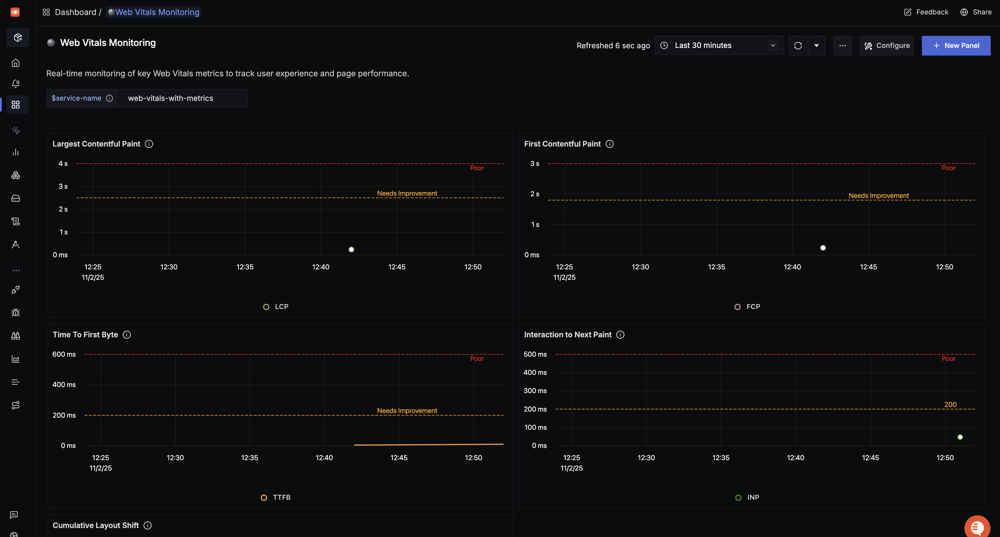

# Web Vitals Monitoring Dashboards

## Setup

Please refer to the instructions [here](https://signoz.io/docs/frontend-monitoring/opentelemetry-web-vitals/) to send web vitals from your frontend application.

## Dashboard panels

### Variables

- `{{service-name}}`: Name of the frontend service

### Panels

- **Web Vitals with Metrics**
  - `Largest Contentful Paint`: p90 of `lcp.bucket` filtered by `service.name = $service-name`; warning at 2.5 s, critical at 4 s.
  - `First Contentful Paint`: p90 of `fcp.bucket` for the selected service; warning at 1.8 s, critical at 3 s.
  - `Interaction to Next Paint`: p90 of `inp.bucket`; warning at 200 ms, critical at 500 ms.
  - `Time To First Byte`: p90 of `ttfb.bucket`; warning at 200 ms, critical at 600 ms.
  - `Cumulative Layout Shift`: average of `cls`; warning above 0.1, critical above 0.25.
  - 

- **Web Vitals with Traces**
  - `TTFB - Time to First Byte`: average `web_vital.value` for trace spans tagged `web_vital.name = TTFB`; warning at 200 ms, critical at 600 ms.
  - `FCP - First Contentful Paint`: average `web_vital.value` where `web_vital.name = FCP`; warning at 1.8 s, critical at 3 s.
  - `LCP - Largest Contentful Paint`: average `web_vital.value` where `web_vital.name = LCP`; warning at 2.5 s, critical at 4 s.
  - `INP - Interaction to Next Paint`: average `web_vital.value` where `web_vital.name = INP`; warning at 200 ms, critical at 500 ms.
  - `CLS - Cumulative Layout Shift`: average `web_vital.value` where `web_vital.name = CLS`; warning above 0.1, critical above 0.25.
  - 